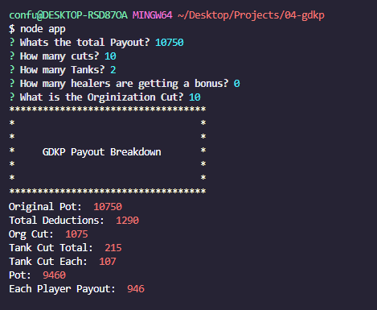

# CLI GDKP Calculator 

## Description

    The USER is prompted with questions
    The APP will then calculate the given payouts accordingly

## Table of Contents

- [Installation](#installation)
- [Usage](#usage)
- [Credits](#credits)
- [License](#license)

## Installation

    npm i

## Usage

    git clone
    Examples to use the repo:

## Credits

[GitHub Link](https://github.com/confusedicarus)

## License

    MIT

    ---

## Badges 

## Features

## How to Contribute

    Contact @confusedicarus

## Tests

    N/A
